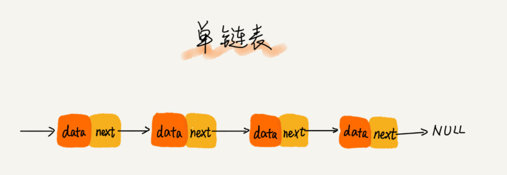
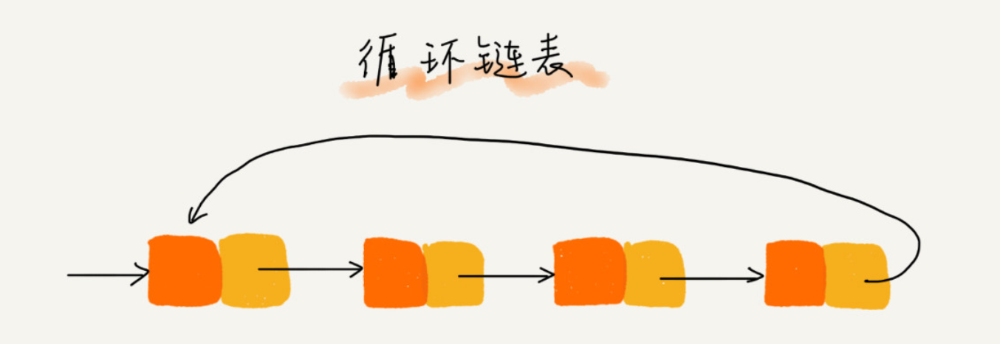
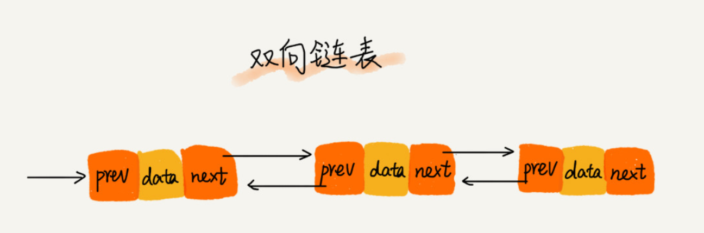
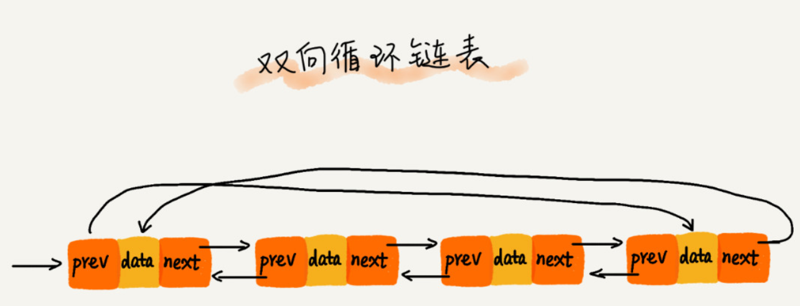
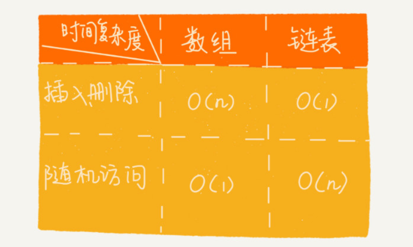

# 链表

## 理论

链表与数组不同，它并不需要一块连续的内存空间，它通过“指针”将一组零散的内存块串联起来使用

### 常见链表类型
- 单链表

- 循环链表

- 双链表

- 双向循环链表

### 常见链表直接的区别

### 链表和数组的性能区别
1：数组简单易用，在实现上使用连续的内存空间，可以借助CPU的缓冲机制预读数组中的数据，所以访问效率更高，而链表在内存中并不是连续存储，所以对CPU缓存不友好，没办法预读。
如果代码对内存的使用非常苛刻，那数组就更适合。

2：插入删除随机访问复杂度

## 实践

- Java中链表的使用和源码阅读总结
   - LinkedHashMap
   - LinkedArrayList
- 单链表反转 206
- 链表中环的检测 141
- 两个有序的链表合并 21
- 删除链表倒数第 n 个结点 19
- 求链表的中间结点 876
- LeetCode 206，141，21，19，876

### 链表代码技巧
技巧二：警惕指针丢失和内存泄漏
技巧三：利用哨兵简化实现难度
技巧四：重点留意边界条件处理
- 如果链表为空时，代码是否能正常工作？
- 如果链表只包含一个结点时，代码是否能正常工作？
- 如果链表只包含两个结点时，代码是否能正常工作？
- 代码逻辑在处理头结点和尾结点的时候，是否能正常工作？